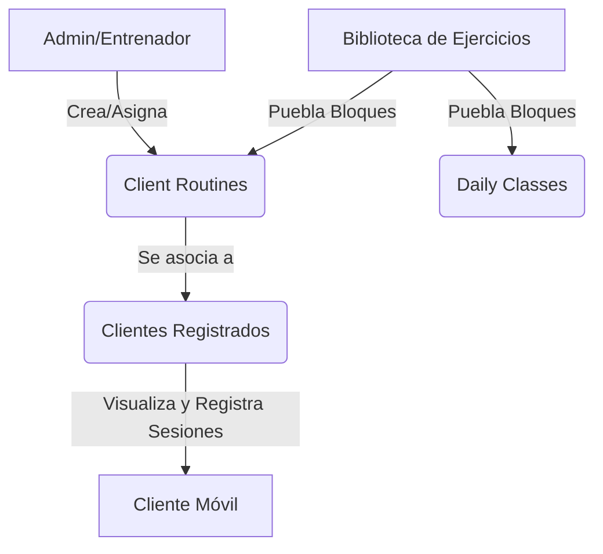

# Contexto del Proyecto: Nenes Gym

Este documento provee el contexto comercial, técnico y de arquitectura para el proyecto **Nenes Gym**.

## 1. Contexto Comercial
**Nenes Gym** es una plataforma de gestión y entrenamiento deportivo personalizada para clientes y administradores de gimnasio.
- **Objetivo**: Proveer una experiencia fluida e intuitiva al cliente final (entrenando en móvil con chips interactivos, registrando su asistencia y progresos) y herramientas de administración potentes al staff/entrenadores (preparando clases, gestionando biblioteca de ejercicios y asignando rutinas personalizadas).
- **Modelo de Negocio**: Optimización de embudos de prospección, fidelización de clientes y seguimiento dinámico de membresías.

---

## 2. Arquitectura del Sistema
El proyecto está desarrollado utilizando **Next.js (App Router)** y **Supabase** como base de datos y backend de autenticación.

### Dominios Principales (Independientes)
El sistema divide su lógica de entrenamiento en dos grandes bloques:
1. **Módulo de Clases (`daily_classes`)**:
   - Planificación día a día de clases grupales.
   - Generación automática de clases en base a plantillas predefinidas.
   - Utiliza las tablas `daily_classes`, `class_templates`, etc.
2. **Módulo de Rutinas (`client_routines`)**:
   - Programas de entrenamiento personalizados y asignados individualmente a cada cliente.
   - Ciclo de vida de la rutina: `draft` ➔ `active` ➔ `paused` ➔ `completed` ➔ `archived`.
   - Utiliza las tablas `client_routines`, `routine_templates`, etc.
3. **Biblioteca de Ejercicios (`exercises`)**:
   - Biblioteca de ejercicios compartida por ambos módulos para estructurar bloques y entrenamientos.

---

## 3. Flujos de Datos Principales

### Experiencia del Administrador (Hub de Entrenamiento)
- **Ruta**: `/admin/entrenamiento`
- Colapsa el acceso a **Clases**, **Rutinas** y **Biblioteca de Ejercicios** en un solo hub simplificado, liberando espacio en el menú de navegación inferior del administrador.
- **Creación paso a paso**: Selección obligatoria del cliente ➔ Selección del método (En blanco, Plantilla o Clase) ➔ Formulario visual simplificado de asignación.
- **Menu contextual dinámico**: Acciones administrativas avanzadas (Pausar, Finalizar, Archivar, Cambiar cliente) encapsuladas en un menú contextual dinámico basado en el estado actual de la rutina.
