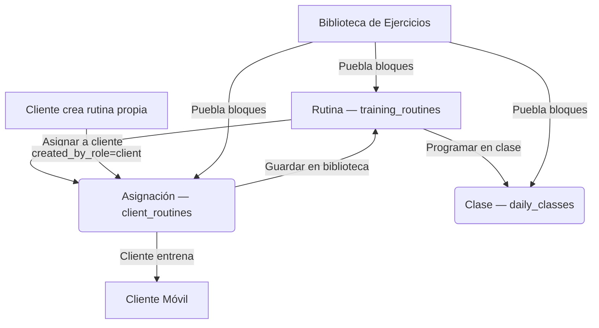

# Contexto del Proyecto: Nenes Gym

Este documento provee el contexto comercial, técnico y de arquitectura para el proyecto **Nenes Gym**.

## 1. Contexto Comercial
**Nenes Gym** es una plataforma de gestión y entrenamiento deportivo personalizada para clientes y administradores de gimnasio.
- **Objetivo**: Proveer una experiencia fluida e intuitiva al cliente final (entrenando en móvil con chips interactivos, registrando su asistencia y progresos) y herramientas de administración potentes al staff/entrenadores (gestionando una biblioteca de rutinas reutilizable, asignándolas a clientes y programándolas como clases).
- **Modelo de Negocio**: Optimización de embudos de prospección, fidelización de clientes y seguimiento dinámico de membresías.

---

## 2. Arquitectura del Sistema
El proyecto está desarrollado utilizando **Next.js (App Router)** y **Supabase** como base de datos y backend de autenticación.

### Modelo de Entrenamiento: Rutina → Asignación → Clase
Desde la Sesión 8 (2026-07-12), el módulo de entrenamiento gira en torno a un solo concepto reutilizable en vez de dos sistemas paralelos de "plantillas":

1. **Rutina (`training_routines`)** — el contenido reutilizable de la biblioteca del gym. Estructura Día → Bloque → Ejercicio (`training_routine_days` → `training_routine_blocks` → `training_routine_exercises`). Gym-wide, sin `client_id`. Se crea, edita, duplica y archiva desde la tab "Rutinas".
2. **Asignación (`client_routines`)** — una **copia independiente** de una rutina entregada a un cliente (no un vínculo en vivo: editar la rutina base no afecta asignaciones ya hechas). Ciclo de vida: `draft` ➔ `active` ➔ `paused` ➔ `completed` ➔ `archived`. Un cliente puede tener varias asignaciones activas en paralelo. `source_type='training_routine'` + `source_id` trazan de qué rutina de biblioteca provino (si aplica). También puede ser `created_by_role='client'` cuando el cliente crea su propia rutina desde su perfil.
3. **Clase (`daily_classes`)** — una **sesión de una rutina programada en una fecha** (y opcionalmente hora, guardada dentro de `notes` ya que la tabla no tiene columna de hora). También es una copia independiente (`source_routine_id`/`source_routine_day_id` para trazabilidad). Un mismo día admite varias clases/rutinas programadas.

**Biblioteca de Ejercicios (`exercises`)**: compartida por los tres niveles para estructurar bloques.

### Experiencia del Administrador
- **Diseño Unificado (Bebas Neue)**: Todos los títulos principales de la navegación (`Inicio`, `Clientes`, `Pagos`, `Entrenamiento`, `Ingresos` y `Más`) utilizan la tipografía de marca condensada **Bebas Neue** (`font-bebas`) en mayúsculas y tracking espaciado.
- **Sección Clientes (`/admin/clientes`)**: Tarjetas de cliente con acabado metálico degradado (`from-zinc-700/40 to-zinc-950/90`) y bordes sólidos de acero (`border-zinc-700`). Círculo de días restantes minimalista con micro-punto verde indicador de actividad y avatar con borde de color dinámico (verde para activo, rojo para inactivo).
  - Fila de botones inferiores con grid de 2 columnas: *"Activar/Expandir plan"* (vía modal) y el botón directo de un solo clic *"Pago 1 día (efectivo)"* para transacciones en físico en caja.

### Entrenamiento y Asignación (`/admin/entrenamiento`)
Un solo shell con **3 tabs persistentes** (vía `?tab=`):
- **Rutinas** (tab por defecto): biblioteca. Buscar, crear, editar, duplicar, archivar, eliminar, asignar y programar en clase.
- **Asignaciones**: Lista unificada que combina a **todos los clientes actuales** (tengan o no rutinas).
  - Pestaña **Todas**: Muestra a todo el alumnado. Si no poseen una programación de entrenamiento, indica *"Sin rutina asignada"* en texto rojo y habilita un botón con icono `UserPlus` animado.
  - Pestañas de filtros por estado y por ausencia de rutina (*Sin rutina*).
- **Clases**: agenda vertical de 14 días.

El perfil de cada cliente (`/admin/clientes/[id]`) tiene un botón "Rutinas" que lleva a una página aparte (`/admin/clientes/[id]/rutinas`) con las asignaciones hechas por el admin y las creadas por el cliente.

### Responsive de Escritorio (Sesión 9, 2026-07-13)
La app nació mobile-first (`BottomNav` fijo, sin breakpoints). Desde esta sesión, tanto `(admin)` como `(cliente)` agregan un sidebar fijo de escritorio (`AdminSidebar` / `ClientSidebar` en `src/components/layout/`) que reutiliza los mismos ítems de navegación del `BottomNav` (exportados desde ahí: `adminItems`, `clienteItems`, `useIsActive`). El `BottomNav` se oculta en `md:` y superiores; el sidebar toma su lugar. Las listas que antes eran una sola columna estirada a todo el ancho en desktop (clientes, pagos, rutinas) usan `grid md:grid-cols-2 xl:grid-cols-3`.

### Patrones Compartidos de UI (Sesión 9, 2026-07-13)
- **`LoadingButton`** (`src/components/ui/loading-button.tsx`): único patrón de botón con estado pendiente (`pending`/`pendingText`, `aria-busy`, bloqueo anti doble-clic). No impone estilo — recibe `className` como un `<button>` normal, para convivir con `btn-glossy-red` y demás clases ya usadas. Usarlo en toda acción async nueva en vez de reimplementar spinner+disabled a mano.
- **`Skeleton`** (`src/components/ui/skeleton.tsx`): bloque `animate-pulse` base para armar `loading.tsx` con la forma real del contenido de cada sub-ruta, en vez de depender del spinner genérico de `(admin)/loading.tsx` / `(cliente)/loading.tsx`.
- **Check-in (`/cliente/asistencia`)**: `useCheckIn` (`src/components/qr/use-check-in.ts`) es la única puerta de entrada a `/api/check-in` — la usan tanto el escáner QR como el formulario de código manual, para no duplicar la validación de servidor (`process_check_in` RPC en Supabase).
- **`select("*")` en acciones de rutinas**: evitarlo. `training-routines.actions.ts` y `routines.actions.ts` seleccionan columnas explícitas porque cada fetch ahí es una copia servidor-a-servidor (duplicar/asignar/programar) — nunca se devuelve al cliente, así que traer la fila completa no aporta nada.

### Flujos de Datos Principales

### Rendimiento, Caché y Mejoras de Usabilidad (Sesión 10 y 11, 2026-07-17 y 2026-07-18)
- **Sistemas de Caché en Servidor y Hotfix de Producción**: Se introdujo caching de alto rendimiento a través de `unstable_cache` para la sección de entrenamientos, la configuración global del gimnasio y el listado/pendientes de pagos (`admin-payments`). Se resolvió un crash crítico de Next.js en producción reemplazando `createClient()` (cliente de cookies) por `createAdminClient()` (cliente de service role) en todos los callbacks de caché, aislando inquilinos (`gym_id`) de manera estática y segura.
- **Rediseño y Pestañas en Pagos de Administrador**: Se reestructuró la pantalla `/admin/pagos` usando pestañas navegables persistentes en la URL (`?tab=por-aprobar` y `?tab=historial`). El historial de pagos se optimizó en una grilla responsiva de dos columnas en computadoras. Adicionalmente, las tarjetas de medios de pago (Nequi y Daviplata) se rediseñaron con gradientes temáticos premium de marca e incorporan el titular de la cuenta correspondiente.
- **Formulario de Planes Autocompletado**: Integración de plantillas rápidas de autocompletado (`3x/4x/5x/6x sem`) en el formulario de nuevos planes para autocompletar la vigencia (30 días), asistencias totales y formato del nombre del plan automáticamente en un clic.
- **Eliminación Segura de Planes**: Botón de borrado directo de planes con confirmación emergente, controlado en base de datos mediante la interceptación del código de error Postgres `23503` (Foreign Key Constraint) para sugerir la desactivación en lugar de la eliminación si el plan ya está en uso por miembros.
- **Compatibilidad Binaria en Subidas**: Optimización de subidas a Supabase Storage convirtiendo los objetos `File` provenientes de Server Actions a `Buffer` en Node.js, solucionando bloqueos y archivos vacíos (0 bytes) en la subida de imágenes de ejercicios y comprobantes de membresías.

